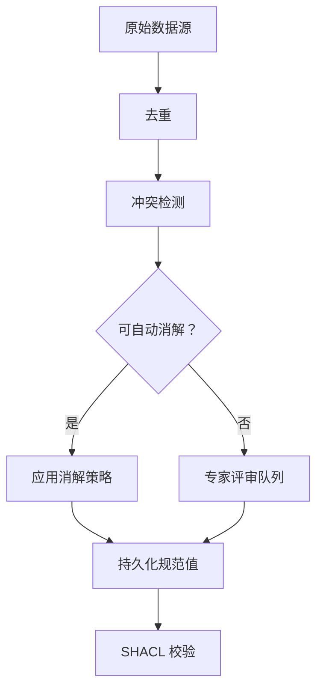

`ConflictDetector` 找出多个数据源对同一规范实体给出不一致取值的属性，`ConflictResolver` 则按属性应用消解策略——可信度加权投票、最新优先、专家评审等——产出一个带完整审计记录的消解值。在去重之后、SHACL 校验之前运行。

<Info>
冲突检测要在去重之后、SHACL 校验之前运行。去重负责删除重复节点；冲突消解负责调和同一规范实体上相互矛盾的属性值。顺序颠倒了——先检测冲突再去重——就会在本应先合并的实体之间制造出虚假冲突。
</Info>

## 什么是冲突消解？

把多个数据源合并到一起时，同一个现实世界实体——一位客户、一件商品、一个威胁行为者、一种药物化合物——经常会带着互相矛盾的属性值出现。一个数据库说客户的邮箱是 `alice@example.com`，另一个说是 `alice.smith@example.com`；一个安全数据源给某个 CVE 评 10.0 分，另外两个分别评 9.1 和 9.5。

说白了，冲突消解(Conflict Resolution)就是决定"哪个值最可信"、并把这一决定连同证据记录下来的系统化过程——最终让规范实体(Canonical Entity)的每个属性都留下一个经得起追问、可审计的值。

### 核心概念

**规范实体** — 现实世界事物对应的唯一权威记录。去重之后，每个实体在图中恰好有一个规范节点。冲突消解决定的就是：哪些属性值应该落在这个节点上。

**冲突值** — 同一规范实体的同一属性上，由不同数据源分别给出的两个及以上互不相同的取值。

**可信度评分(Credibility Score)** — 你附着在每条源记录上的 0.0 到 1.0 之间的数，表示该来源有多可靠。政府登记库可以给 0.99，抓取来的博客可以给 0.30。这些分数由你提供，Semantica 在 `CREDIBILITY_WEIGHTED` 消解时使用它们。

**置信度评分(Confidence Score)** — 消解器在消解*之后*计算出的 0.0 到 1.0 之间的数，反映结果有多确定。全体一致的投票产生高置信度；同等可信的来源之间票数接近，置信度就低。它出现在 `ResolutionResult.confidence` 上，应当作一个信号来读，而不是"消解值一定正确"的保证。

**消解策略(Resolution Strategy)** — 挑出胜出值的规则：多数投票、可信度加权、最新时间戳，等等。完整清单见[消解策略一览](#消解策略一览)。

**审计记录(Audit Trail)** — 每一次消解决定的完整记录：冲突 ID、所用策略、消解值、参考过的来源、置信度评分。由 `resolver.get_resolution_history()` 返回。

**溯源感知的消解** — 不仅记录胜出的值，还记录它来自哪个来源。每个 `ResolutionResult` 都带 `sources_used` 字段，因此你总能把规范值追溯到它的出处——这在受监管的环境中至关重要。

## 为什么要用冲突消解？

- **多源流水线必然产生分歧。** 更新节奏、录入习惯、来源可靠性的差异无法避免。没有显式的消解步骤，你就会在毫无记录的情况下默认偏向某一个来源。
- **你得到一份经得起质询、可审计的决策日志。** 合规团队、审计师和领域专家需要知道哪个来源胜出、为什么。审计记录提供的正是这些。
- **简单情况自动处理，困难情况人工升级。** 例行的分歧——拼写略有差异的名称、过时的时间戳——由算法消解。真正含糊的情况——相互冲突的法律分类、不同的临床终点——会被标记出来交由专家评审，同时不阻塞流水线的其余部分。

## 适用与不适用场景

**适合用冲突消解的场景：**
- 你在为同一实体合并两个及以上的独立来源。
- 各来源在属性值上存在分歧，而你需要一个唯一的规范值。
- 你需要为每次消解决定留下一份可审计的记录。
- 部分冲突需要领域专家评审后才能消解。

**可以跳过冲突消解的场景：**
- **已经存在单一权威来源。** 如果对某个属性而言某个系统永远正确，直接读它即可。围绕单一来源再叠加消解机制，只会徒增复杂度而没有收益。
- **所有来源永远一致。** 跳过之前先实测验证一下；实践中静默的分歧很常见。
- **你想保留所有冲突值。** 如果保留每个来源的主张比挑出一个胜者更重要，那就直接在图模式中为溯源建模，而不是消解出唯一赢家。

## 典型工作流



1. **去重** — 合并重复节点，让每个实体恰好有一条规范记录。冲突消解的对象是单一规范实体；比较不同来源的说法之前，必须先把它确定下来。见[去重](./deduplication.md)。
2. **冲突检测(Conflict Detection)** — 调用 `detect_entity_conflicts()` 一次性找出全部属性分歧，或用 `detect_value_conflicts()` 针对特定属性。
3. **消解** — 对每个冲突应用一种策略（`CREDIBILITY_WEIGHTED`、`MOST_RECENT`、`VOTING` 等），或转交专家评审（`EXPERT_REVIEW`）。
4. **持久化规范值** — 把消解后的值写回规范实体或图存储。见[持久化消解结果](#持久化消解结果)。
5. **SHACL 校验** — 对消解后的图施加结构约束，确认它满足你的本体。见[SHACL 校验](./shacl-validation.md)。

## 快速上手：入门示例

在进入领域场景之前，先看走通这条 API 的最短路径。三个系统——CRM、ERP 和 LDAP 目录——保存着同一位客户略有差异的联系信息。三者中有两个一致认为规范邮箱是 `alice.smith@example.com`，CRM 里则是旧值。

```python
from semantica.conflicts import ConflictDetector, ConflictResolver, ResolutionStrategy

# 同一位客户，三个来源——只有 email 不一致
customer_records = [
    {"id": "cust-001", "source": "crm",  "email": "alice@example.com",       "phone": "+1-555-0100"},
    {"id": "cust-001", "source": "erp",  "email": "alice.smith@example.com", "phone": "+1-555-0100"},
    {"id": "cust-001", "source": "ldap", "email": "alice.smith@example.com", "phone": "+1-555-0100"},
]

# 第 1 步：一次性检测所有属性冲突——无需逐个指名属性
detector = ConflictDetector()
conflicts = detector.detect_entity_conflicts(customer_records)

print(f"Conflicts found: {len(conflicts)}")
for c in conflicts:
    print(f"  Property : {c.property_name}")
    print(f"  Values   : {c.conflicting_values}")
    print(f"  Severity : {c.severity}")

# 第 2 步：消解——三个来源里有两个一致，多数票胜出
resolver = ConflictResolver()
results = resolver.resolve_conflicts(conflicts, strategy=ResolutionStrategy.VOTING)

for r in results:
    print(f"\n[{'RESOLVED' if r.resolved else 'REVIEW'}] {r.conflict_id}")
    print(f"  Resolved value : {r.resolved_value}")
    print(f"  Strategy       : {r.resolution_strategy}")
    print(f"  Confidence     : {r.confidence:.0%}")
    print(f"  Sources used   : {r.sources_used}")
```

```text
Conflicts found: 1
  Property : email
  Values   : ['alice@example.com', 'alice.smith@example.com', 'alice.smith@example.com']
  Severity : medium

[RESOLVED] cust-001_email_conflict
  Resolved value : alice.smith@example.com
  Strategy       : voting
  Confidence     : 67%
  Sources used   : ['crm', 'erp', 'ldap']
```

`detect_entity_conflicts()` 自动扫描了 `email` 和 `phone` 两个字段——你并没有逐一指名。由于 `phone` 在三条记录中完全一致，没有为它检出冲突。email 的分歧之所以消解为 `alice.smith@example.com`，是因为三个来源中有两个认同这个值。

当一批冲突都应使用同一策略时，直接给 `resolve_conflicts()` 传 `strategy=`。当不同的实体-属性组合需要不同策略时，用 `set_resolution_rule()`——详见[设置逐属性消解规则](#设置逐属性消解规则)。

## 检测冲突

`ConflictDetector` 提供三个方法，按情况选用：

| 方法 | 扫描内容 | 适用时机 |
| :--- | :--- | :--- |
| `detect_entity_conflicts(entities)` | 每个实体的全部属性，一次完成 | 第一遍扫描；事先不知道哪些属性会冲突 |
| `detect_value_conflicts(entities, property_name)` | 所有实体上的某一个具名属性 | 针对已知的高发属性做定点检查 |
| `detect_relationship_conflicts(relationships)` | 同一节点对之间的边类型 | 图边上的结构性分歧 |

### 一次扫描全部属性——`detect_entity_conflicts`

对新流水线来说，`detect_entity_conflicts()` 是推荐的起点。它检查实体记录上发现的每个属性，返回一个包含全部冲突的扁平列表——你无需预先枚举属性。

```python
detector = ConflictDetector()
all_conflicts = detector.detect_entity_conflicts(records)
# 一次调用返回所有属性上的全部冲突
```

如果已经为某个实体类型注册过冲突字段，传入 `entity_type` 可以把检测限定在这些字段上：

```python
# 把检测限定到为该实体类型注册的字段
all_conflicts = detector.detect_entity_conflicts(records, entity_type="vulnerability")
```

不传 `entity_type` 时，检测器会检查实体字典里出现的每个键（`id`、`source`、`metadata` 之类的记账字段除外）。先从这里拿到全貌，再决定哪些冲突用哪种消解策略。

### 扫描指定属性——`detect_value_conflicts`

已经明确要查哪个属性，或者想对不同属性施加不同的检测逻辑时，用 `detect_value_conflicts()`。`ConflictDetector` 先按实体 ID 把记录分组，再比较各来源在该属性上的取值。任何实体只要有两条及以上来源给出不同值，就会产生一个 `Conflict` 对象。

```python
from semantica.conflicts import ConflictDetector, ConflictResolver, ResolutionStrategy

# 三个权威来源评价同一个 CVE——都可信，但互相不一致
cve_records = [
    {
        "id": "cve-2024-3400",
        "source": "nvd",
        "cvss_score": 10.0,
        "exploit_status": "unconfirmed",
        "vector": "AV:N/AC:L/PR:N/UI:N/S:C/C:H/I:H/A:H",
        "metadata": {"timestamp": "2024-04-11T12:00:00Z"},
    },
    {
        "id": "cve-2024-3400",
        "source": "commercial_feed",
        "cvss_score": 9.1,
        "exploit_status": "in_wild",
        "vector": "AV:N/AC:L/PR:N/UI:N/S:U/C:H/I:H/A:H",
        "metadata": {"timestamp": "2024-04-12T15:30:00Z"},
    },
    {
        "id": "cve-2024-3400",
        "source": "vendor_paloalto",
        "cvss_score": 9.5,
        "exploit_status": "in_wild",
        "vector": "AV:N/AC:H/PR:N/UI:N/S:C/C:H/I:H/A:H",
        "metadata": {"timestamp": "2024-04-12T12:00:00Z"},
    },
]

detector = ConflictDetector()

# 检测 CVSS 评分属性上的分歧
score_conflicts = detector.detect_value_conflicts(cve_records, property_name="cvss_score")
exploit_conflicts = detector.detect_value_conflicts(cve_records, property_name="exploit_status")

print(f"CVSS score conflicts  : {len(score_conflicts)}")
print(f"Exploit status conflicts: {len(exploit_conflicts)}")

for c in score_conflicts:
    print(f"\nConflict: {c.conflict_id}")
    print(f"  Entity   : {c.entity_id}")
    print(f"  Property : {c.property_name}")
    print(f"  Values   : {c.conflicting_values}")   # [10.0, 9.1, 9.5]
    print(f"  Severity : {c.severity}")              # 'medium' — 数值差 < 1000
    print(f"  Sources  : {[s['document'] for s in c.sources]}")
    print(f"  Action   : {c.recommended_action}")
```

```text
CVSS score conflicts  : 1
Exploit status conflicts: 1

Conflict: cve-2024-3400_cvss_score_conflict
  Entity   : cve-2024-3400
  Property : cvss_score
  Values   : [10.0, 9.1, 9.5]
  Severity : medium
  Sources  : ['nvd', 'commercial_feed', 'vendor_paloalto']
  Action   : Multiple conflicting values detected. Manual review recommended.
```

每个 `Conflict` 对象都记录了完整信息：哪个实体、哪个属性、每个不一致的值、以及每个值出自哪个来源。这些已足够搭建一个评审队列——但我们的目标是按你设定的规则把它们自动消解掉。

## 设置逐属性消解规则

`set_resolution_rule(entity_id, property_name, strategy)` 为特定的"实体-属性"组合注册一个策略。消解器把规则存放在 `entity_id.property_name` 这个键下，调用 `resolve_conflicts()` 时自动套用。

由于规则同时以实体 ID 和属性名为键，`set_resolution_rule()` 是逐实体生效的。不存在能一次性作用于所有实体或所有属性的通配规则。

**何时用 `set_resolution_rule()`：** 不同的实体-属性组合需要不同策略时用它。例如同一实体的 `legal_name` 用 `CREDIBILITY_WEIGHTED`，而 `last_updated` 用 `MOST_RECENT`。逐组合注册规则后，一次 `resolve_conflicts()` 调用就能在单趟里把它们全部正确处理。

**何时直接给 `resolve_conflicts()` 传 `strategy=`：** 一批冲突都该用同一策略时，直接传参即可，不必为每个实体-属性对都注册规则：

```python
# 所有冲突用同一策略——无需逐属性规则
results = resolver.resolve_conflicts(all_conflicts, strategy=ResolutionStrategy.CREDIBILITY_WEIGHTED)
```

比起为了套用同一策略而循环调用 `set_resolution_rule()` 遍历每个实体，这样写干净得多。

**CVE 示例的逐属性规则：**

```python
resolver = ConflictResolver()

# 注册来源可信度评分，供 CREDIBILITY_WEIGHTED 使用
resolver.source_tracker.set_source_credibility("nvd", 0.98)
resolver.source_tracker.set_source_credibility("commercial_feed", 0.91)
resolver.source_tracker.set_source_credibility("vendor_paloalto", 0.87)

# 对这个 CVE 而言，NVD 是评分方面最权威的来源。
# CREDIBILITY_WEIGHTED 用注册的来源可信度给投票加权
# ——0.98 的 NVD 会压过 0.91 的商业数据源。
resolver.set_resolution_rule(
    "cve-2024-3400",
    "cvss_score",
    ResolutionStrategy.CREDIBILITY_WEIGHTED,
)

# 利用状态是时效性信息：商业数据源和厂商都已观察到在野利用，
# 这比 NVD 最初"未确认"的评估更新。MOST_RECENT 会取元数据里
# 时间戳最新的来源给出的值。
resolver.set_resolution_rule(
    "cve-2024-3400",
    "exploit_status",
    ResolutionStrategy.MOST_RECENT,
)
```

规则可以在检测之前或之后设置——消解器在 `resolve_conflicts()` 被调用时才应用它们。

## 批量消解

把检出的全部冲突交给 `resolve_conflicts()`。对每个冲突，消解器会查找该实体-属性组合是否注册了规则：有就用那个策略；没有就回落到默认策略（投票，除非你在构造函数里另行指定）。

```python
all_conflicts = score_conflicts + exploit_conflicts

results = resolver.resolve_conflicts(all_conflicts)

for r in results:
    status = "RESOLVED" if r.resolved else "REVIEW REQUIRED"
    print(f"[{status}] {r.conflict_id}")
    print(f"  Resolved value : {r.resolved_value}")
    print(f"  Strategy used  : {r.resolution_strategy}")
    print(f"  Confidence     : {r.confidence:.0%}")
    print(f"  Sources used   : {r.sources_used}")
    print(f"  Notes          : {r.resolution_notes}")
    print()
```

```text
[RESOLVED] cve-2024-3400_cvss_score_conflict
  Resolved value : 10.0
  Strategy used  : credibility_weighted
  Confidence     : 36%
  Sources used   : ['nvd', 'commercial_feed', 'vendor_paloalto']
  Notes          : Resolved by credibility-weighted voting (weight: 0.98)

[RESOLVED] cve-2024-3400_exploit_status_conflict
  Resolved value : in_wild
  Strategy used  : most_recent
  Confidence     : 80%
  Sources used   : ['commercial_feed']
  Notes          : Resolved by most recent value
```

NVD 赢下了 CVSS 评分——它的可信度权重（0.98）险胜商业数据源（0.91）和厂商（0.87），于是 10.0 成为规范评分。利用状态则消解为 `in_wild`——商业数据源和厂商通告都比 NVD 的初始分诊更新，且都报告了在野利用。

## 处理需要人工判断的冲突

不是每个冲突都能自动消解。金融工具法律分类之争、患者当前用药清单之争，都重大到不能交给算法。把这类冲突标记出来送评审，同时不阻塞批次里的其余部分：

```python
from semantica.conflicts import ConflictDetector, ConflictResolver, ResolutionStrategy

# 药物试验数据：疗效一致，主要终点有争议
trial_records = [
    {"id": "dapagliflozin", "source": "declare_timi58",
     "primary_endpoint": "MACE",               "hba1c_reduction_pct": 0.54},
    {"id": "dapagliflozin", "source": "dapa_hf",
     "primary_endpoint": "HF_hospitalization", "hba1c_reduction_pct": 0.48},
    {"id": "dapagliflozin", "source": "meta_analysis",
     "primary_endpoint": "HbA1c_reduction",    "hba1c_reduction_pct": 0.52},
]

detector = ConflictDetector()
efficacy_conflicts  = detector.detect_value_conflicts(trial_records, "hba1c_reduction_pct")
endpoint_conflicts  = detector.detect_value_conflicts(trial_records, "primary_endpoint")

resolver = ConflictResolver()

# 注册来源可信度评分
resolver.source_tracker.set_source_credibility("declare_timi58", 0.92)
resolver.source_tracker.set_source_credibility("dapa_hf", 0.95)
resolver.source_tracker.set_source_credibility("meta_analysis", 0.88)

# 疗效：跨试验做可信度加权——荟萃分析(0.88)与两项 RCT(0.92、0.95)
# 会共同产生一个加权消解结果。
resolver.set_resolution_rule(
    "dapagliflozin", "hba1c_reduction_pct", ResolutionStrategy.CREDIBILITY_WEIGHTED
)

# 主要终点：每项试验测的都不是同一件事。这不是能自动消解的冲突
# ——必须由临床医生决定哪个终点适用于当前用途。
resolver.set_resolution_rule(
    "dapagliflozin", "primary_endpoint", ResolutionStrategy.EXPERT_REVIEW
)

all_conflicts = efficacy_conflicts + endpoint_conflicts
results = resolver.resolve_conflicts(all_conflicts)

auto_resolved = [r for r in results if r.resolved]
for_review    = [r for r in results if not r.resolved]

print(f"Auto-resolved : {len(auto_resolved)}")
print(f"Expert review : {len(for_review)}")

# 导出评审队列，交给临床团队
import json
review_queue = [
    {
        "conflict_id": r.conflict_id,
        "notes": r.resolution_notes,
        "metadata": r.metadata,
    }
    for r in for_review
]
with open("expert_review_queue.json", "w") as fh:
    json.dump(review_queue, fh, indent=2, default=str)
```

```text
Auto-resolved : 1
Expert review : 1   # primary_endpoint — EXPERT_REVIEW means resolved=False
```

`EXPERT_REVIEW` 会把结果的 `resolved` 置为 `False`。冲突在图中保持未消解状态，metadata 字段带有 `requires_expert_review: True`，而评审队列 JSON 给临床团队提供的正是拍板所需的全部信息。

## 持久化消解结果

`resolve_conflicts()` 返回 `ResolutionResult` 对象——它不会自动把消解值写回你的图或实体存储。这一步要由你基于流水线所用的存储层自行实现。

最直接的做法是把每个 `ResolutionResult` 与原始 `Conflict` 对象配对——两个列表按相同顺序返回——再把胜出的值写到规范实体上：

```python
# canonical_entity 是你的权威记录——dict、图节点、数据库行均可
canonical_entity = {"id": "cve-2024-3400", "cvss_score": None, "exploit_status": None}

for conflict, result in zip(all_conflicts, results):
    if result.resolved:
        canonical_entity[conflict.property_name] = result.resolved_value
        # 记录溯源：这个值来自哪个来源
        print(f"  {conflict.property_name} = {result.resolved_value} "
              f"(from {result.sources_used}, confidence {result.confidence:.0%})")

# 把 canonical_entity 持久化到你的图存储、数据库或下游系统。
```

```text
  cvss_score = 10.0 (from ['nvd', 'commercial_feed', 'vendor_paloalto'], confidence 36%)
  exploit_status = in_wild (from ['commercial_feed'], confidence 80%)
```

几点注意事项：

- **`resolved=False` 的冲突**——已标记待专家或人工评审——在人来拍板之前不应写入规范记录。把它们留在评审队列里。
- **置信度是信号，不是保证。** 72% 的置信度意味着消解器掌握的证据比较充分但并非一致同意。写入生产环境之前，对低置信度的结果要格外审慎。
- **追踪溯源。** `result.sources_used` 告诉你哪个来源的值胜出。如果合规要求完整的证据链，请把它与规范值一起存储。

## 查看完整审计记录

消解运行结束后，`get_resolution_history()` 返回自消解器实例化以来的每一次决定。这就是你的合规日志：

```python
history = resolver.get_resolution_history()

print(f"Total resolutions logged: {len(history)}")
for r in history:
    status = "RESOLVED" if r.resolved else "PENDING"
    print(f"[{status}] {r.conflict_id}")
    print(f"  Strategy   : {r.resolution_strategy}")
    print(f"  Value      : {r.resolved_value}")
    print(f"  Confidence : {r.confidence:.0%}")
```

再配合检测器的完整冲突报告，就能得到跨所有运行的汇总统计：

```python
report = detector.get_conflict_report()

print(f"Total conflicts detected  : {report['total_conflicts']}")
print(f"By type                   : {report['by_type']}")
print(f"By severity               : {report['by_severity']}")
# Total conflicts detected  : 6
# By type                   : {'value_conflict': 6}
# By severity               : {'medium': 6}
```

报告会汇总检测器整个生命周期内见过的每一个冲突——可用于流水线监控，也可用于识别哪些实体类型或数据源制造的分歧最多。

## 检测关系冲突

值冲突存在于属性上，关系冲突则存在于边上——两个来源对同一节点对给出了相互矛盾的联系：

```python
# 两个情报来源对 APT29 是否利用该 CVE 持不同看法
relationships = [
    {"source": "apt29", "target": "cve-2024-3400",
     "type": "EXPLOITS",     "origin": "mandiant"},
    {"source": "apt29", "target": "cve-2024-3400",
     "type": "UNRELATED_TO", "origin": "crowdstrike"},
]

rel_conflicts = detector.detect_relationship_conflicts(relationships)
for c in rel_conflicts:
    print(f"Relationship conflict: {c.conflict_id}")
    print(f"  Edge type values: {c.conflicting_values}")
    print(f"  Severity: {c.severity}")
```

关系冲突通常需要专家评审而非投票，因为相互矛盾的边类型往往反映的是真正不同的情报判断，而不是录入错误。

## 领域示例

<Tabs>

<Tab title="国防——CTI/威胁">

一个威胁情报平台合并来自 Mandiant、CrowdStrike 和一个开源博客的行为者画像。三个来源一致认为 APT29 来自俄罗斯、动机为间谍活动，但在首次观测时间上存在分歧——更关键的是，其中一个来源把它归因(Attribution)给中国。当高可信来源意见一致时，低可信来源（博客，0.30）应当败给它们（Mandiant 0.95、CrowdStrike 0.92）。

可信度加权消解干净利落地处理了这种情况：博客的错误归因被两家权威厂商的合计权重淹没。`first_seen` 日期的分歧（2008 vs 2009）同样由可信度权重裁决，Mandiant 的 2008 胜出。

```python
from semantica.conflicts import ConflictDetector, ConflictResolver, ResolutionStrategy

actor_profiles = [
    {"id": "apt29", "source": "mandiant",    "nation_state": "Russia",
     "first_seen": "2008"},
    {"id": "apt29", "source": "crowdstrike", "nation_state": "Russia",
     "first_seen": "2009"},
    {"id": "apt29", "source": "oss_blog",    "nation_state": "China",  # 错误
     "first_seen": "2015"},
]

detector = ConflictDetector()
nation_conflicts     = detector.detect_value_conflicts(actor_profiles, "nation_state")
first_seen_conflicts = detector.detect_value_conflicts(actor_profiles, "first_seen")

resolver = ConflictResolver()
resolver.source_tracker.set_source_credibility("mandiant", 0.95)
resolver.source_tracker.set_source_credibility("crowdstrike", 0.92)
resolver.source_tracker.set_source_credibility("oss_blog", 0.30)

resolver.set_resolution_rule("apt29", "nation_state", ResolutionStrategy.CREDIBILITY_WEIGHTED)
resolver.set_resolution_rule("apt29", "first_seen",   ResolutionStrategy.CREDIBILITY_WEIGHTED)

results = resolver.resolve_conflicts(nation_conflicts + first_seen_conflicts)
for r in results:
    print(f"{r.conflict_id}: {r.resolved_value!r}  [{r.confidence:.0%} confidence]")
    # apt29_nation_state_conflict: 'Russia'  [86% confidence]
    # apt29_first_seen_conflict:   '2008'    [44% confidence]
    # 博客的中国归因（权重 0.30）败给 Mandiant+CrowdStrike（0.95+0.92）。

history = resolver.get_resolution_history()
print(f"Audit log entries: {len(history)}")
```

</Tab>

<Tab title="安全——SOC/事件响应">

一个漏洞管理系统为同一 CVE 摄取来自 NVD、MITRE 和厂商通告的 CVSS 评分。NVD 与 MITRE 都是权威机构；厂商则在评分上天然倾向于保守。可信度加权消解让 NVD（0.98）与 MITRE（0.96）压过厂商（0.90），得到的规范评分反映的是独立权威机构的共识。

CVSS 向量串同样存在冲突——scope 字段（`S:C` vs `S:U`）的分歧是真实的解读分歧，会影响该 CVE 是否被归类为网络横向移动风险。两个冲突都按同样的可信度加权方式处理。

```python
from semantica.conflicts import ConflictDetector, ConflictResolver, ResolutionStrategy

cve_records = [
    {"id": "cve-2024-3400", "source": "nvd",
     "cvss_score": 10.0, "vector": "AV:N/AC:L/PR:N/UI:N/S:C/C:H/I:H/A:H"},
    {"id": "cve-2024-3400", "source": "mitre",
     "cvss_score": 9.8,  "vector": "AV:N/AC:L/PR:N/UI:N/S:U/C:H/I:H/A:H"},
    {"id": "cve-2024-3400", "source": "paloalto",
     "cvss_score": 9.5,  "vector": "AV:N/AC:H/PR:N/UI:N/S:C/C:H/I:H/A:H"},
]

detector = ConflictDetector()
score_conflicts  = detector.detect_value_conflicts(cve_records, "cvss_score")
vector_conflicts = detector.detect_value_conflicts(cve_records, "vector")

resolver = ConflictResolver()
resolver.source_tracker.set_source_credibility("nvd", 0.98)
resolver.source_tracker.set_source_credibility("mitre", 0.96)
resolver.source_tracker.set_source_credibility("paloalto", 0.90)

resolver.set_resolution_rule(
    "cve-2024-3400", "cvss_score", ResolutionStrategy.CREDIBILITY_WEIGHTED
)
resolver.set_resolution_rule(
    "cve-2024-3400", "vector", ResolutionStrategy.CREDIBILITY_WEIGHTED
)

results = resolver.resolve_conflicts(score_conflicts + vector_conflicts)
for r in results:
    if r.resolved:
        print(f"Canonical {r.conflict_id.split('_')[2]}: {r.resolved_value}  "
              f"({r.confidence:.0%} confidence)")
    # Canonical cvss_score: 10.0   (35% confidence)  — NVD wins
    # Canonical vector: AV:N/AC:L/PR:N/UI:N/S:C/C:H/I:H/A:H  (35% confidence)
```

</Tab>

<Tab title="生命科学——临床/制药">

一个药物安全知识图谱合并三项研究——DECLARE-TIMI 58、DAPA-HF 和一项荟萃分析——的达格列净试验数据。HbA1c 降幅在各试验之间不同，是因为各自入组的人群不同。主要终点不同，则是因为每项试验要回答的临床问题本来就不一样——这是真正的科学区别，不是数据错误。

疗效数值可以做可信度加权；有争议的终点必须送专家评审。这种分流处理——能自动消解的自动消解，拿不准的升级人工——正是受监管数据环境的标准做法。

```python
from semantica.conflicts import ConflictDetector, ConflictResolver, ResolutionStrategy

drug_records = [
    {"id": "dapagliflozin", "source": "declare_timi58",
     "hba1c_reduction_pct": 0.54, "primary_endpoint": "MACE"},
    {"id": "dapagliflozin", "source": "dapa_hf",
     "hba1c_reduction_pct": 0.48, "primary_endpoint": "HF_hospitalization"},
    {"id": "dapagliflozin", "source": "meta_analysis",
     "hba1c_reduction_pct": 0.52, "primary_endpoint": "HbA1c_reduction"},
]

detector = ConflictDetector()
efficacy_conflicts = detector.detect_value_conflicts(drug_records, "hba1c_reduction_pct")
endpoint_conflicts = detector.detect_value_conflicts(drug_records, "primary_endpoint")

resolver = ConflictResolver()
resolver.source_tracker.set_source_credibility("declare_timi58", 0.92)
resolver.source_tracker.set_source_credibility("dapa_hf", 0.95)
resolver.source_tracker.set_source_credibility("meta_analysis", 0.88)

resolver.set_resolution_rule(
    "dapagliflozin", "hba1c_reduction_pct", ResolutionStrategy.CREDIBILITY_WEIGHTED
)
resolver.set_resolution_rule(
    "dapagliflozin", "primary_endpoint", ResolutionStrategy.EXPERT_REVIEW
    # resolved=False — 进入临床医生评审队列，不自动消解
)

results = resolver.resolve_conflicts(efficacy_conflicts + endpoint_conflicts)
auto   = [r for r in results if r.resolved]
review = [r for r in results if not r.resolved]

print(f"Auto-resolved  : {len(auto)}")
for r in auto:
    print(f"  {r.conflict_id}: {r.resolved_value}  [{r.confidence:.0%}]")
    # dapagliflozin_hba1c_reduction_pct_conflict: 0.48  [35%]

print(f"Expert queue   : {len(review)}")
for r in review:
    print(f"  {r.conflict_id} — {r.resolution_notes}")
    # dapagliflozin_primary_endpoint_conflict — Flagged for expert review
```

</Tab>

<Tab title="银行——风险/合规">

一个信用风险图合并来自 CRM、全球 LEI 登记库和征信机构的企业客户数据。LEI 登记库是实体名称和行业代码的法律权威——它的可信度应设为 1.0（或视作定论）。CRM 和征信机构的名称可能过时或只是缩写；LEI 登记库保存的是正式注册的法定名称。

为 `legal_name` 和 `sic_code` 设置 `CREDIBILITY_WEIGHTED` 消解、并让 LEI 登记库携带 0.99 的可信度评分，就能保证法律上权威的值永远胜出，并在下一次监管检查时提供完整的审计证据。

```python
from semantica.conflicts import ConflictDetector, ConflictResolver, ResolutionStrategy

client_records = [
    {"id": "corp-acme-uk", "source": "crm",
     "legal_name": "ACME UK Ltd",                "sic_code": "7372"},
    {"id": "corp-acme-uk", "source": "lei_registry",
     "legal_name": "ACME United Kingdom Limited", "sic_code": "7371"},
    {"id": "corp-acme-uk", "source": "credit_bureau",
     "legal_name": "ACME UK Ltd",                "sic_code": "7372"},
]

detector = ConflictDetector()
name_conflicts = detector.detect_value_conflicts(client_records, "legal_name")
sic_conflicts  = detector.detect_value_conflicts(client_records, "sic_code")

resolver = ConflictResolver()
resolver.source_tracker.set_source_credibility("lei_registry", 0.99)
resolver.source_tracker.set_source_credibility("credit_bureau", 0.50)
resolver.source_tracker.set_source_credibility("crm", 0.40)

resolver.set_resolution_rule(
    "corp-acme-uk", "legal_name", ResolutionStrategy.CREDIBILITY_WEIGHTED
)
resolver.set_resolution_rule(
    "corp-acme-uk", "sic_code", ResolutionStrategy.CREDIBILITY_WEIGHTED
)

results = resolver.resolve_conflicts(name_conflicts + sic_conflicts)
for r in results:
    print(f"Canonical {r.conflict_id.split('_')[1]}: {r.resolved_value!r}  "
          f"[{r.confidence:.0%}]")
    # Canonical legal_name: 'ACME United Kingdom Limited'  [52%]  — LEI registry wins
    # Canonical sic_code:   '7371'                         [52%]  — LEI registry wins

# 为合规报告汇总冲突统计
report = detector.get_conflict_report()
print(f"\nConflict audit:")
print(f"  Total detected : {report['total_conflicts']}")
print(f"  By severity    : {report['by_severity']}")
```

</Tab>

</Tabs>

## 消解策略一览

| 策略 | 决策方式 | 最适用于 |
| :--- | :--- | :--- |
| `VOTING` | 出现最多的值胜出 | 3 个以上独立来源；没有明确权威 |
| `CREDIBILITY_WEIGHTED` | 按来源的 `credibility_score` 加权 | 来源有已知的可靠性排序 |
| `MOST_RECENT` | 取时间戳最新的来源给出的值 | 数据衰减快——威胁情报、市场价格 |
| `FIRST_SEEN` | 取最早主张该值的来源给出的值 | 一手来源比二手衍生来源更可靠 |
| `HIGHEST_CONFIDENCE` | 取 `confidence` 字段最高的来源给出的值 | 自动抽取器会输出逐条记录的置信度 |
| `MANUAL_REVIEW` | 标记冲突；`resolved=False` | 低量、高风险的决策 |
| `EXPERT_REVIEW` | 进入领域专家队列；`resolved=False` | 需要科学或法律层面的甄别 |

## 常见陷阱

**先消解冲突、后去重**
同一现实世界实体的重复节点还没清掉时，`ConflictDetector` 会把每个重复当作一个与其他重复"意见相左"的独立实体——制造出本不该存在的虚假冲突。务必先去重。

**忘记持久化消解结果**
`resolve_conflicts()` 返回 `ResolutionResult` 对象，但不会把它们写到任何地方。看完结果就收工、不更新规范实体，意味着数据里其实什么都没变。见[持久化消解结果](#持久化消解结果)。

**在大实体集上逐个属性扫描**
对手动循环里的每个属性都调一次 `detect_value_conflicts()`，会对数据产生重复遍历。改用 `detect_entity_conflicts()`——一次调用处理所有属性，是批量检测的推荐起点。

**误解可信度评分**
可信度评分是你基于对来源可靠性的先验认知赋予的权重——不是客观事实。注册为 `set_source_credibility("source", 0.99)` 的来源照样可能出错。`CREDIBILITY_WEIGHTED` 消解放大的是你对来源质量的信念；如果这些信念本身失准，消解结果也会跟着失准。在生产中依赖它们之前，先用已知事实校验这些分数。

**把消解值当作必然正确的事实**
消解值是在给定来源和策略下最经得起质询的答案——未必是正确的那个。低置信度评分和 `EXPERT_REVIEW` 标记都在提醒你：写入规范记录或下游系统之前，先仔细核查。

**存在单一权威来源时仍用冲突消解**
如果对某个属性而言某个系统永远正确，直接读它即可。在单一来源上再叠加冲突消解，只会增加复杂度、引入不必要的疑虑，产出的审计记录也不带来任何真实信息。

**为统一套用一种策略而循环注册规则**
为了给每个实体-属性对套用同一策略而逐一调用 `set_resolution_rule()`，会带来毫无收益的 O(N) 开销。一种策略覆盖整批时，直接给 `resolve_conflicts()` 传 `strategy=`。

## 相关指南

- [去重](./deduplication.md) — 运行冲突检测之前，先删除重复节点
- [溯源](./provenance.md) — 追踪每个消解值来自哪个来源，并以密码学方式校验审计记录
- [SHACL 校验](./shacl-validation.md) — 冲突消解完成后施加结构约束
- [变更管理](./change-management.md) — 在冲突消解运行前后给图谱打快照
- [本体管理](./ontology.md) — 把实体类型对齐到共享词表，在模式层面减少类型冲突
